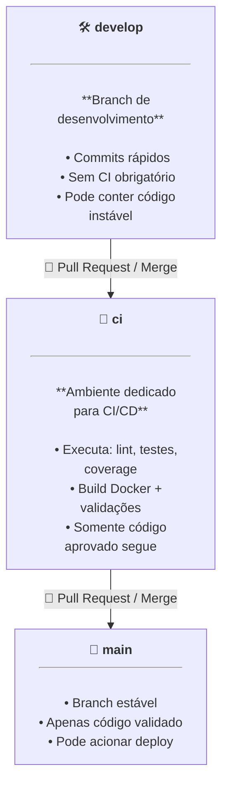

# RAG Project

 - [**Introdução e Objetivos do Projeto**](#intro-to-the-project)
 - [**git workflow**](#git-workflow)
<!---
[WHITESPACE RULES]
- Different topic = "100" Whitespace character.
- Same topic = "50" Whitespace character.
- Subtopic = "10" Whitespace character.
--->

<!--- ( Introdução e Objetivos do Projeto ) --->

---

## Introdução e Objetivos do Projeto

O **RAG Project** foi desenvolvido para solucionar um problema recorrente na *Secretaria de Educação*, onde trabalho (Remígio-PB):

> A **"ausência de um mecanismo de consulta"** em um grande número de pastas, arquivos e formatos.

Para enfrentar esse desafio, o projeto adota uma arquitetura baseada em *Retrieval-Augmented Generation (RAG)*, integrando técnicas de *Processamento de Linguagem Natural (NLP)*, *modelos de linguagem (LLMs)* e *mecanismos de busca vetorial*. O sistema permite transformar dados institucionais estáticos em um repositório consultável e responsivo.

### 🎯 Objetivos Técnicos

 - Centralizar documentos institucionais de forma estruturada.
 - Indexar arquivos através de embeddings semânticos.
 - Realizar consultas híbridas (vetorial + keyword).
 - Fornecer respostas geradas por LLMs baseadas exclusivamente nos dados indexados.
 - Garantir rastreabilidade e auditoria das fontes utilizadas nas respostas.

### 🏗️ Arquitetura do Sistema

A solução é dividida em *quatro camadas* principais:

 - **1. Ingestão de Dados:**
   - Extração de conteúdo de PDFs, DOCXs, planilhas e documentos administrativos.
   - Normalização de texto e limpeza semântica.
   - Pipeline automatizado de pré-processamento (fragmentação, tokenização, chunking).
 - **2. Indexação e Armazenamento:**
   - Geração de embeddings com modelo compatível com LLM escolhido.
   - Armazenamento em banco vetorial.
 - **3. Recuperação da Informação (Retrieval):**
   - Recuperação baseada em similaridade vetorial.
   - Suporte a filtros estruturados (metadata filtering).
   - Opcional: rerankers para melhorar precisão do top-k.
 - **4. Geração da Resposta (LLM Layer):**
   - Pipeline RAG com prompt engineering focado em:
     - grounding em documentos institucionais;
     - citar fontes;
     - evitar alucinações;
     - manter conformidade administrativa.
   - Respostas são geradas usando LLMs locais ou hospedados (OpenAI, Azure, vLLM, etc.).

<!--- ( git workflow ) --->

---

## git workflow

Esse projeto segue o seguinte workflow (fluxo de trabalho):

### `develop — Desenvolvimento Ativo`

> **A branch develop é utilizada para o trabalho diário.**

 - Aqui os commits são rápidos e frequentes, sem necessidade de executar pipelines de CI/CD.
 - Ela pode conter código instável, protótipos ou modificações ainda em validação.

Principais características:

 - Alterações livres para acelerar o desenvolvimento;
 - Não executa *CI/CD* automaticamente (evita lentidão);
 - Serve como base para evolução contínua do projeto.

### `ci-cd — Validação e Qualidade (CI/CD obrigatório)`

> **Todo código destinado a entrar na main deve passar pela branch ci-cd.**

Ela funciona como uma *“camada de proteção”*, garantindo que apenas commits totalmente validados avancem.

Nesta branch o GitHub Actions executa:

 - verificação de lint;
 - testes automatizados;
 - análise de cobertura;
 - build e validação de Docker;
 - inspeções de segurança (opcional);
 - validação de ambiente completo via docker-compose.

### `main — Estável / Produção`

> **A branch main contém sempre o estado atual estável e validado do projeto.**

Boas práticas:

 - Não permite push direto (apenas via Pull Request vindo da ci);
 - Pode acionar workflows de build final e deploy;
 - Deve permanecer íntegra e confiável.

### `🎯 Vantagens desse fluxo`

 - **Velocidade:**
   - Desenvolvimento fluido na `develop`, sem executar CI a cada mudança.
 - **Segurança:**
   - Nada chega na `main` sem passar por todos os testes.
 - **Qualidade:**
   - Bugs são detectados antes de afetar a branch estável.
 - **Manutenabilidade:**
   - Branches com papéis bem definidos facilitam colaboração e revisão de código.
 - **Escalabilidade:**
   - Estrutura compatível com projetos profissionais e pipelines complexos.

---

**Rodrigo** **L**eite da **S**ilva - **rodirgols89**
